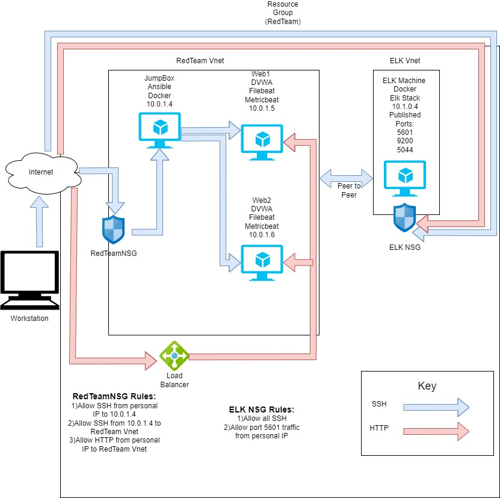

#readme
A collection of projects and tasks demonstrating a proficiency in cyber and network security related programs.
## Automated ELK Stack Deployment
The files in this repository were used to configure the network depicted below.
-
These files have been tested and used to generate a live ELK deployment on Azure. They can be used to either recreate the entire deployment pictured above. Alternatively, select portions of the _____ file may be used to install only certain pieces of it, such as Filebeat.

-[Ansible/filebeat-playbook.yml](Ansible/filebeat-playbook.yml)
-[Ansible/metricbeat-playbook.yml](Ansible/metricbeat-playbook.yml)
-[Ansible/filebeat-config.yml](Ansible/filebeat-config.yml)
-[Ansible/metricbeat-config.yml](Ansible/metricbeat-config.yml)
-[Ansible/pentest.yml](Ansible/pentest.yml)
-[Ansible/elk.yml](Ansible/elk.yml)

This document contains the following details:
- Description of the Topology
- Access Policies
- ELK Configuration
  - Beats in Use
  - Machines Being Monitored
- How to Use the Ansible Build
### Description of the Topology
The main purpose of this network is to expose a load-balanced and monitored instance of DVWA, the D*mn Vulnerable Web Application.
Load balancing ensures that the application will be highly redundant, in addition to restricting traffic to the network.
What aspect of security do load balancers protect? What is the advantage of a jump box?_
Load Balancers protect the servers from Denial of Service Attacks. Jump Box is a single gateway into our system to reduce the target size for an attack.
Integrating an ELK server allows users to easily monitor the vulnerable VMs for changes to the data and system logs.
What does Filebeat watch for? Log Data
What does Metricbeat record? Metrics and Statistics
The configuration details of each machine may be found below.
| Name     | Function | IP Address | Operating System |
|----------|----------|------------|------------------|
| Jump Box | Gateway  | 10.0.1.4   | Linux            |
| Web 1    |  VM      | 10.0.1.5   | Linux            |
| Web 2    |  VM      | 10.0.1.6   | Linux            |
| Elk      |  HOST    | 10.1.0.4   | Linux            |
### Access Policies
The machines on the internal network are not exposed to the public Internet. 
Only the Jump Box machine can accept connections from the Internet. Access to this machine is only allowed from the following IP addresses:
My Public IP
Machines within the network can only be accessed by my Jump Box 20.248.197.159.
A summary of the access policies in place can be found in the table below.
| Name     | Publicly Accessible | Allowed IP Addresses |
|----------|---------------------|----------------------|
| Jump Box | No                  | My Personal IP       |
| Web 1    | No                  | 10.0.1.4             |
| Web 2    | No                  | 10.0.1.4             |
| Elk      | No                  | 10.0.1.4             |
### Elk Configuration
Ansible was used to automate configuration of the ELK machine. No configuration was performed manually, which is advantageous because...
Saving time and minimizing errors
The playbook implements the following tasks:
Install docker.io
Install pip3
Install Docker python module
Increase virtual memory
Download and launch a docker
The following screenshot displays the result of running `docker ps` after successfully configuring the ELK instance.

### Target Machines & Beats
This ELK server is configured to monitor the following machines:
Web 1 10.0.1.5
Web 2 10.0.2.6
We have installed the following Beats on these machines:
Microbeats
These Beats allow us to collect the following information from each machine:
Filebeat - collects data about the file system
Metricbeat - collects machine metrics, such as uptime
### Using the Playbook
In order to use the playbook, you will need to have an Ansible control node already configured. Assuming you have such a control node provisioned: 
SSH into the control node and follow the steps below:
- Copy the playbook file to Ansible Node.
- Update the hosts file to include webserver and elk.
- Run the playbook, and navigate to Kibana (http://13.73.99.133/app/kibana#/home) to check that the installation worked as expected.
- _Which file is the playbook? filebeat-playbook.yml
- _Where do you copy it? /etc/ansible/
- _Which file do you update to make Ansible run the playbook on a specific machine? /etc/ansible/hosts
- _How do I specify which machine to install the ELK server on versus which to install Filebeat on? 2 separate groups: webservers (IPs of VMs where Filebeat is installed) & elkservers (IP of the VM where elk is installed)
- _Which URL do you navigate to in order to check that the ELK server is running? http://13.73.99.133:5601/
